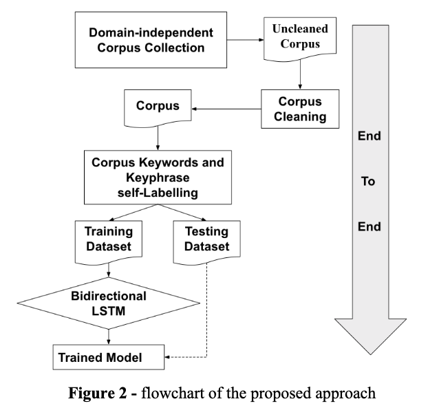

+++
title = "1.1 KeyBert"
weight = 001
+++

## 使用场景

KeyBERT是一种小型且容易上手使用的关键字提取技术，它利用BERT嵌入来创建与文档最相似的关键词和关键字短语。

尽管我们已经有许多可用于关键字生成的方法(例如，Rake、YAKE!、TF-IDF等)，但是我们还是需要创建一种非常高效并且功能强大的方法来提取关键字和关键字。 这就是KeyBERT诞生的初衷！ 
它使用BERT嵌入和简单的余弦相似性来查找文档中与文档本身最相似的子短语。

首先，使用BERT提取文档向量(嵌入)以获取文档级表示。 然后，针对N元语法词/短语提取词向量。 最后，我们使用余弦相似度来查找与文档最相似的词/短语。 然后，可以将最相似的词识定义为最能描述整个文档的词。

KeyBERT可能不是唯一的提取关键词的方法，它的定位主要是一种用于创建关键字和关键词的快速简便的方法。 尽管有很多出色的论文和解决方案都使用BERT嵌入，但是很少有直接基于BERT的解决方案，该工具无需从头开始进行训练模型，初学者也可直接使用

## 原理介绍

## 动手实验

* 直接使用，代码：https://github.com/jackie930/financial-Forecast-RCA/blob/main/code/keyword_extraction/KeyBert/demo.ipynb
* 部署成推理节点使用， 代码：https://github.com/jackie930/financial-Forecast-RCA/blob/main/code/keyword_extraction/KeyBert/deploy.ipynb 

## 参考
* 代码：https://github.com/MaartenGr/KeyBERT 
* paper：https://www.preprints.org/manuscript/201908.0073/download/final_file 
