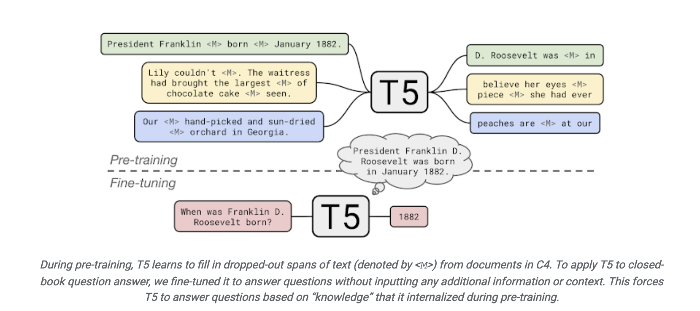

+++
title = "1.3 T5-Prompt"
weight = 003
+++

## NLP 模型的发展

过去许多机器学习方法是基于全监督学习 (fully supervised learning) 的.

由于监督学习需要大量的数据学习性能优异的模型, 而在 NLP 中大规模训练数据(指为特定任务而标注好的数据)是不足的, 因此在深度学习出现之前研究者通常聚焦于特征工程 (feature engineering), 即利用领域知识从数据中提取好的特征;

在深度学习出现之后, 由于特征可以从数据中习得, 因此研究者转向了结构工程 (architecture engineering), 即通过通过设计一个合适的网络结构来把归纳偏置 (inductive bias) 引入模型中, 从而有利于学习好的特征.

在 2017-2019 年, NLP 模型开始转向一个新的模式 (BERT), 即预训练 + 微调 (pre-train and fine-tune). 在这个模式中, 先用一个固定的结构预训练一个语言模型 (language model, LM), 预训练的方式就是让模型补全上下文 (比如完形填空).

由于预训练不需要专家知识, 因此可以在网络上搜集的大规模文本上直接进行训练. 然后这个 LM 通过引入额外的参数或微调来适应到下游任务上. 此时研究者转向了 目标工程 (objective engineering), 即为预训练任务和微调任务设计更好的目标函数.

## prompt learning 介绍

在做 objective engineering 的过程中, 研究者发现让下游任务的目标与预训练的目标对齐是有好的. 因此下游任务通过引入文本提示符 (textual prompt), 把原来的任务目标重构为与预训练模型一致的填空题.

比如一个输入 “I missed the bus today.” 的重构:

    情感预测任务. 输入: “I missed the bus today. I felt so ___.” 其中 “I felt so” 就是提示词 (prompt), 然后使用 LM 用一个表示情感的词填空.
    翻译任务. 输入: “English: I missed the bus today. French: ___.” 其中 “English:” 和 “French:” 就是提示词, 然后使用 LM 应该再空位填入相应的法语句子.

我们发现用不同的 prompt 加到相同的输入上, 就能实现不同的任务, 从而使得下游任务可以很好的对齐到预训练任务上, 实现更好的预测效果.

后来研究者发现, 在同一个任务上使用不同的 prompt, 预测效果也会有显著差异, 因此现在有许多研究开始聚焦于 prompt engineering.

## T5原理介绍

## 动手实验
https://github.com/jackie930/financial-Forecast-RCA/blob/main/code/keyword_extraction/T5-Prompt/model.ipynb

