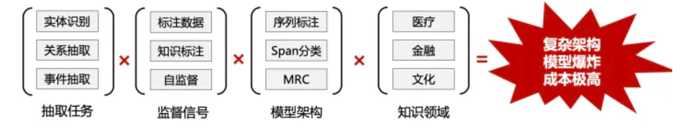
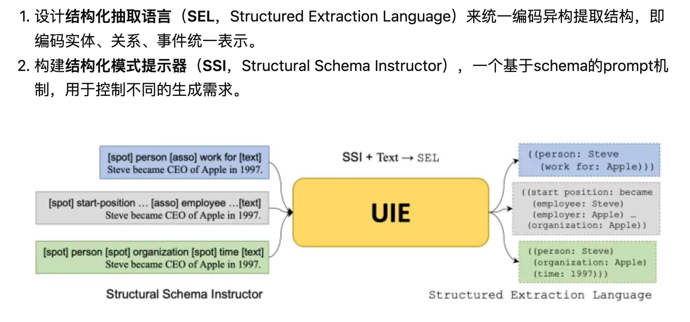

+++
title = "1.2 UIE"
weight = 002
+++

## 使用场景

信息抽取（IE）是一个从文本到结构的转换过程。常见的实体、关系、事件分别采取Span、Triplet、Record形式的异构结构。

曾几何时，当我们面对各种复杂多样的IE任务，我们总会造各式各样IE模型的轮子，来满足不同复杂任务的多变需求。

真实的情况是：针对不同任务设定，需要针对特定领域schema建模，不同IE模型被单个训练、不共享，一个公司可能需要管理众多IE模型。

因而，随着NLP的发展，统一/通用的IE是一个众望所归的模型。

UIE来自2022ACL, 他可以做到：

* 统一地建模不同的IE任务
* 自适应地生成目标结构
* 从不同的知识来源统一学习通用的信息抽取能力。

## 原理介绍

UIE提出的统一生成框架，基于T5模型进行了IE预训练，在实体、关系、事件和情感等4个信息抽取任务、13个数据集的全监督、低资源和少样本设置下均取得了SOTA性能。

## 优势

* 使用简单：用户可以使用自然语言自定义抽取目标，无需训练即可统一抽取输入文本中的对应信息。实现开箱即用，并满足各类信息抽取需求。
* 降本增效：以往的信息抽取技术需要大量标注数据才能保证信息抽取的效果，为了提高开发过程中的开发效率，减少不必要的重复工作时间，开放域信息抽取可以实现零样本（zero-shot）或者少样本（few-shot）抽取，大幅度降低标注数据依赖，在降低成本的同时，还提升了效果。
* 效果领先：开放域信息抽取在多种场景，多种任务上，均有不俗的表现。

## 动手实验

https://github.com/jackie930/financial-Forecast-RCA/blob/main/code/keyword_extraction/UIE/uie_byos_gpu.ipynb 

## 参考
* uie 源码 https://github.com/universal-ie/UIE 
* paddlenlp https://github.com/PaddlePaddle/PaddleNLP/tree/develop/model_zoo/uie 
* paper https://arxiv.org/pdf/2203.12277.pdf 