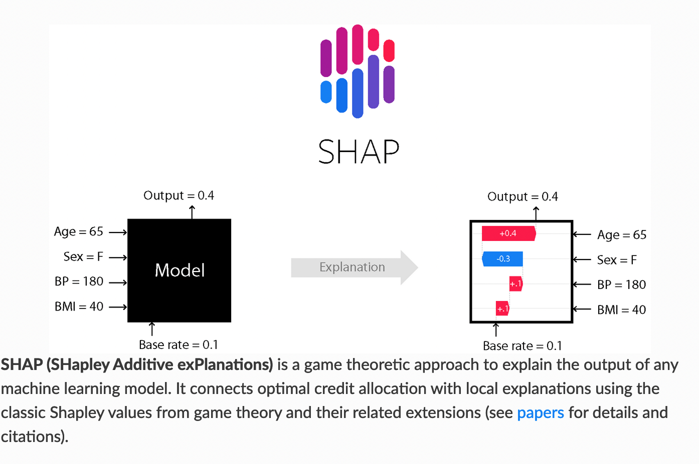
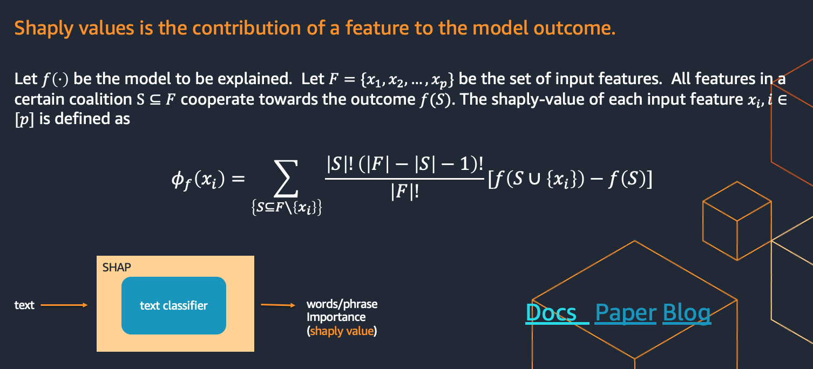
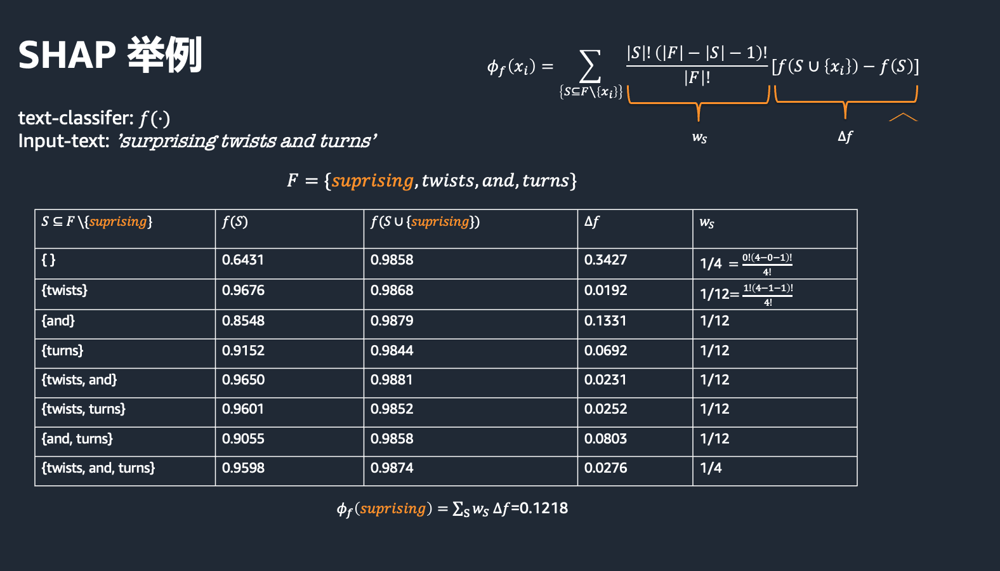

---
SHAP 归因模型介绍
---
**Authors**

* JUNYI LIU (AWS GCR Sr. Applied Scientist)
* KAIGE YANG (AWS GCR Applied Scientist)

## 概述
SHAP 归因模型分析每一个输入变量对与模型输出的影响大小

## 相关链接
* SHAP 官方文档 [External Link](https://shap.readthedocs.io/en/latest/)
* SHAP 论文 [External Link](https://proceedings.neurips.cc/paper/2017/hash/8a20a8621978632d76c43dfd28b67767-Abstract.html)
* SHAP 相关blog [External Link](https://towardsdatascience.com/shaps-partition-explainer-for-language-models-ec2e7a6c1b77)

## 原理
SHAP 分析并计算 每个输入变量的对模型输出的影响大小 i.e., shaply-value

## 原理实践
* 假设 f 为文本分类模型。 该模型输入为文本，输出 [0,1]
* 举例 文本输入为： text= 'suprising twits and turns'。 本输入中包含 4 个输入变量
    F={superising, twists, and , turns}
* SHAP 模型 计算并输出 每一个变量的shaply-value 
* 以变量 superising 为例， 下面展示shaply-value的具体计算过程

## 动手实验