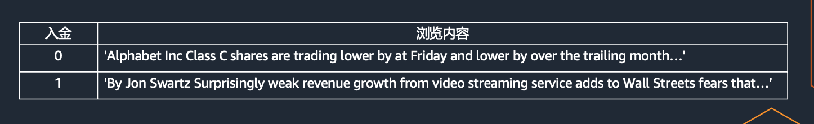
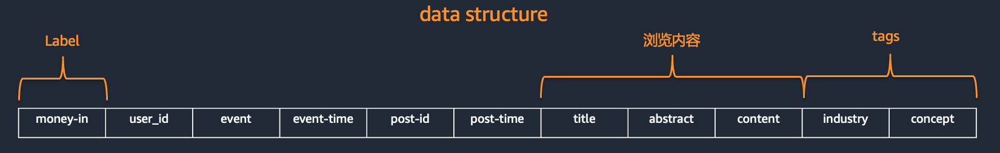
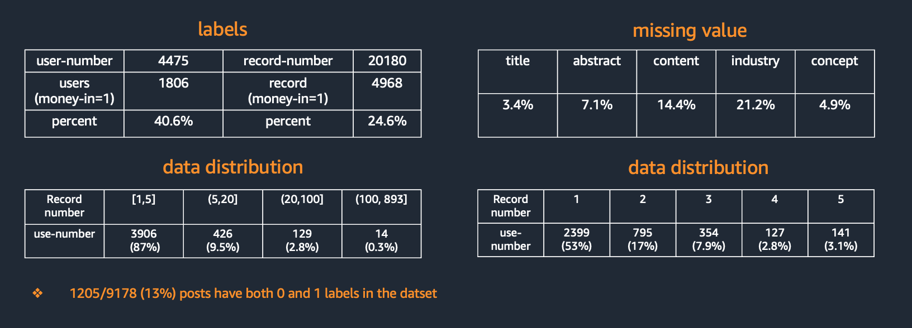
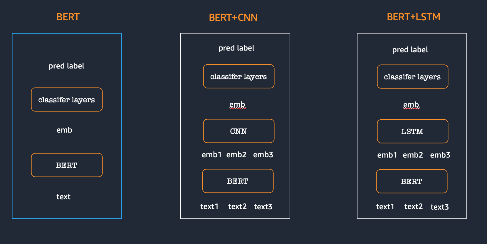

---
阅读行为分类模型介绍
---
**Authors**

* JUNYI LIU (AWS GCR Sr. Applied Scientist)
* KAIGE YANG (AWS GCR Applied Scientist)

## 任务概述
* 用户浏览投资相关内容（新闻，feed， 报告 等） 并产生入金行为
* 基于用户浏览内容构建文本分类模型判断是否有入金行为

## 数据形式
已有数据包含用户和浏览内容的相关信息

数据的基本概况
* 数据包含4479 个用户， 20180 条数据
* 其中 1806 个用户具有入金行为 占比 40.6%
* 其中 4968 条数据包含入金行为 占比 24.6%
* 其中 2399 个用户 只有1条记录，占比 53%， 超过5 条数据的用户占比 13%

## 数据准备
* 数据清洗： 除去标点和数字
* 缺失值填充： 空格代替缺失值
* 异常值处理： 个别用户浏览超过800+条内容

## 文本分类模型搭建
基于BERT 与训练模型 创建文本分类模型。 基本架构如下
* 基于单条文本预测模型（a.k.a. BERT)
* 基于最近三条浏览文本的预测模型 （a.k.a, BERT+CNN, BERT+LSTM)

## 动手实验